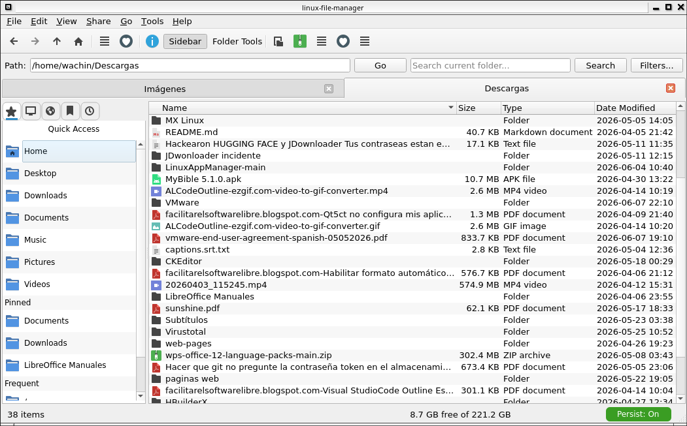

# Linux File Manager

[](https://github.com/wachin/linuxfilemanager)
[](https://www.linux.org/)
[](https://www.python.org/)
[](https://www.riverbankcomputing.com/software/pyqt/)
[](LICENSE)
[](ROADMAP.md)

Lightweight modular file manager for Linux built with Python 3 and PyQt6.

This project aims to provide a familiar, efficient file management workflow while staying fast, simple, and Linux-friendly.

## Highlights

- Modular PyQt6 application structure
- Multiple view modes: icons, list, details, compact
- Quick Access, bookmarks, recent locations, and tabbed navigation
- XDG User Directories support for localized and user-customized standard folders
- Core file operations: copy, move, rename, delete, trash, create folder/file
- Search in the current folder with filters
- Preview and properties panels
- Archive extraction and ZIP creation
- Undo/redo support for several file operations
- Desktop integration through `xdg-open`, MIME detection, and default app handling
- Debian packaging skeleton and AppStream metadata

## Project Status

`Linux File Manager` is currently a working prototype under active development.

Already implemented:

- Main window, sidebar, workspace, preview panel, and status bar
- File navigation history and multiple tabs
- Context menus and toolbar actions
- XDG-compliant Quick Access that resolves Desktop, Downloads, Documents, Music, Pictures, and Videos from the system instead of hardcoded English folder names
- Bookmarks kept separate from built-in Quick Access places by default
- Search, bookmarks, trash, properties, and basic archive support
- Configurable UI preferences such as font and window size

Planned and tracked:

- See [ROADMAP.md](ROADMAP.md)
- See [ROADMAP_TODOS.md](ROADMAP_TODOS.md)

## Requirements

- Linux
- Python 3.11+
- PyQt6

Recommended desktop integration packages on Debian 12 / MX Linux 23:

```bash
sudo apt update
sudo apt install \
  python3 python3-pyqt6 python3-pyqt6.qtsvg \
  qt6ct \
  xdg-utils shared-mime-info desktop-file-utils \
  gvfs gvfs-common gvfs-daemons gvfs-fuse gvfs-libs gvfs-backends \
  cifs-utils nfs-common sshfs davfs2 \
  p7zip-full unrar-free zip unzip binutils \
  qt6-translations-l10n
```

These packages enable:

- desktop file and MIME integration
- network locations such as SMB, SFTP, WebDAV, and mounted shares
- practical ZIP, 7z, RAR, TAR, and `.deb` handling
- Qt 6 icon-theme selection through `qt6ct`
- Qt translation support where available

## How to change the icon theme for Linux File Manager

To change the icon theme for Linux File Manager when using Qt 6 theme icons:

1. Run `qt6ct`.
2. Open the `Icon theme` tab and wait for the installed themes to load.
3. Choose a theme and click `Apply`.
4. Close Linux File Manager and open it again.

The application will then use the selected system icon theme.

## Quick Start

Run from the repository root:

```bash
python3 main.py
```



Or install locally and use the console entry point:

```bash
python3 -m pip install .
linuxfm
```

## Development Setup

Install the application dependencies:

```bash
python3 -m pip install PyQt6
```

Install test dependencies:

```bash
python3 -m pip install pytest
```

Run the test suite:

```bash
python3 -m pytest -q
```

## Repository Layout

```text
.
├── lfmapp/         Application package
├── data/           Desktop entry, icon, AppStream metadata
├── debian/         Debian packaging files
├── tests/          Automated tests
├── translations/   Qt translation sources
├── scripts/        Utility scripts
├── ROADMAP.md
└── ROADMAP_TODOS.md
```

## Configuration

User settings are stored in:

```text
~/.local/share/linux-file-manager/config.json
```

Examples of configurable settings:

- window width and height
- remember window size
- global font family, style, and size
- sidebar and preview visibility
- hidden files, file extensions, and selection checkboxes
- preferred terminal for `Open in Terminal`

## XDG User Directories

Linux File Manager now follows the FreeDesktop XDG User Directories specification for standard user folders.

This means `Quick Access` resolves:

- Home
- Desktop
- Downloads
- Documents
- Music
- Pictures
- Videos

from the actual system configuration rather than assuming English folder names like `~/Desktop` or `~/Documents`.

Resolution order:

1. `xdg-user-dir`
2. `~/.config/user-dirs.dirs`

Only existing directories are shown, duplicate paths are avoided, and user-customized or localized folders such as `~/Escritorio`, `~/Documentos`, or `~/Bureau` are supported automatically.

By design:

- `Quick Access` contains the built-in XDG locations.
- `Bookmarks` contains only user-created bookmarks.
- `This Computer` focuses on Home, `/`, drives, removable media, and Trash.
- `Recents` remains dedicated to recent files and folders.

You can change these settings from:

- `Tools > Preferences...`
- `View > Font Size`

## Packaging

The repository includes:

- Python package metadata in [pyproject.toml](pyproject.toml)
- Desktop integration files in [data/linux-file-manager.desktop](data/linux-file-manager.desktop) and [data/linux-file-manager.metainfo.xml](data/linux-file-manager.metainfo.xml)
- Debian packaging scaffolding in [debian/](debian)

## Contributing

Contributions are welcome. Useful areas include:

- UI and workflow polish
- Linux desktop integration
- performance improvements for large folders
- automated tests
- packaging and release automation

Before opening larger changes, check [TODOS.md](TODOS.md) to align with current priorities.

## License

This project is licensed under the GNU General Public License v3.0 or later.
