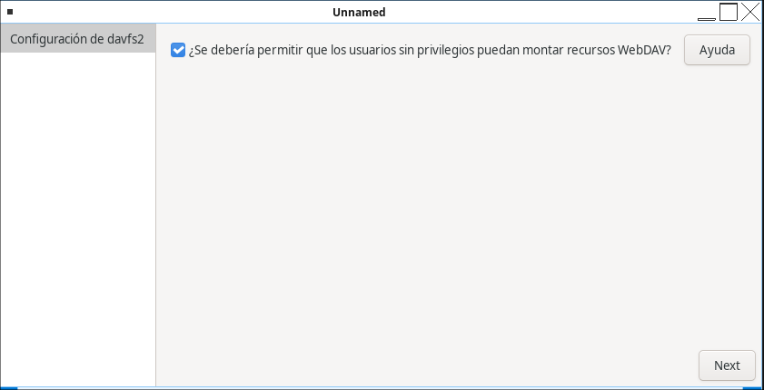
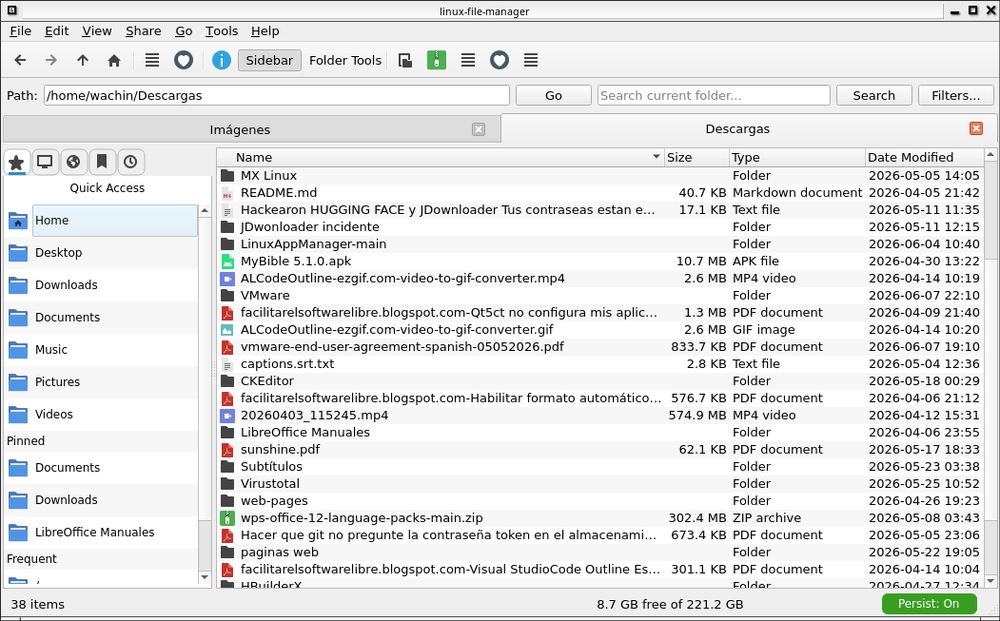

# Linux File Manager

[](https://github.com/wachin/linuxfilemanager)
[](https://www.linux.org/)
[](https://www.python.org/)
[](https://www.riverbankcomputing.com/software/pyqt/)
[](LICENSE)
[](ROADMAP.md)

Lightweight modular file manager for Linux built with Python 3 and PyQt6.

This project aims to provide a familiar, efficient file management workflow while staying fast, simple, and Linux-friendly.

## AI Agents Welcome — Help Continue This Project

Are you a developer who writes code with an AI assistant? This repository is prepared for exactly that: it ships guide files that AI coding agents read (and many follow automatically), so you and your agent can start contributing right away.

- [`AGENTS.md`](AGENTS.md) — canonical conventions for AI agents and contributors (golden rule, current architecture, how to test).
- [`CLAUDE.md`](CLAUDE.md) — quick-start guide for Claude Code and other agents (points to `AGENTS.md`).
- [`.github/copilot-instructions.md`](.github/copilot-instructions.md) — instructions for GitHub Copilot.
- [`CONTRIBUTING.md`](CONTRIBUTING.md) — how to contribute: rules, tests, and pull requests.

**You are invited to continue this development.** The full plan lives in [`ROADMAP.md`](ROADMAP.md): phases 0–13 plus a prioritized backlog. Pick any open task aligned with your skills, open an issue or a pull request, and help build the best file manager for Linux together. Every contribution — code, tests, documentation, translations, or ideas — is welcome.

## Highlights

- Modular PyQt6 application structure
- Multiple view modes: icons, list, details, compact, and flat (whole tree in one list)
- Expandable folders (inline tree): toggle `View > Expandable Folders` to show expansion arrows on subfolder rows in Details view; click or `Alt+Down` to peek inside without changing the active folder
- Per-folder view memory: view mode, sorting, grouping, icon grid and Details columns saved per folder, with optional inheritance from parent folders
- Quick Access, bookmarks, recent locations, and tabbed navigation
- XDG User Directories support for localized and user-customized standard folders
- Core file operations: copy, move, rename, delete, trash, create folder/file
- Search in the current folder with filters
- Preview and properties panels
- Archive extraction and ZIP creation
- Undo/redo support for several file operations
- Non-modal notification banners with an inline **Undo** action for reversible operations (e.g. moving to Trash), replacing confirmations that block the workflow
- Automatic highlighting by rules (`View > Highlighting Rules...`): color / font / overlay-icon effects driven by name pattern, type, size, path or tag conditions, stacked with stop-at-first-match and painted via a delegate (the model is never modified)
- Desktop integration through `xdg-open`, MIME detection, and default app handling
- Debian packaging skeleton and AppStream metadata

## Project Status

`Linux File Manager` is currently a working prototype under active development.

Already implemented:

- Main window, sidebar, workspace, preview panel, and status bar
- File navigation history and multiple tabs
- Context menus and toolbar actions
- Per-folder visual persistence: complete folder format (view, sort, group, icon grid, columns) saved per folder and restored on navigation, with parent inheritance and clear commands
- Flat view: the current folder and its whole tree as one list (mixed, files-only, structure-grouped), with a nested-files paste rule (recreate structure vs. same folder)
- Duplicate finder (`Tools > Find Duplicates...`): two-pass detection (size pre-group → xxh64 hash), results grouped with wasted-space indicator, auto-select strategies (keep newest / oldest / shortest path), trash integration
- Thumbnail disk cache: persistent `~/.cache/thumbnails/` following the freedesktop.org spec, so thumbnails survive restarts and are shared with Nautilus/Thunar
- Folder synchronization (`Tools > Folder Synchronization...`): two-phase compare → review → apply with unidirectional/bidirectional modes, selectable update criteria, orphan handling, and a filterable results table
- XDG-compliant Quick Access that resolves Desktop, Downloads, Documents, Music, Pictures, and Videos from the system instead of hardcoded English folder names
- Bookmarks kept separate from built-in Quick Access places by default
- Search, bookmarks, trash, properties, and basic archive support
- Configurable UI preferences such as font and window size

Planned and tracked:

- See [ROADMAP.md](ROADMAP.md) for the full roadmap, phases, and backlog.

## Requirements

- Linux
- Python 3.11+
- PyQt6

Recommended desktop integration packages on Debian 12 / MX Linux 23:

```bash
sudo apt update
sudo apt install \
  python3 python3-pyqt6 python3-pyqt6.qtsvg \
  qt6ct \
  xdg-utils shared-mime-info desktop-file-utils \
  breeze-icon-theme papirus-icon-theme hicolor-icon-theme \
  gvfs gvfs-common gvfs-daemons gvfs-fuse gvfs-libs gvfs-backends \
  cifs-utils nfs-common sshfs davfs2 \
  p7zip-full unrar-free zip unzip binutils \
  qt6-translations-l10n
```

These packages enable:

- desktop file and MIME integration
- network locations such as SMB, SFTP, WebDAV, and mounted shares
- practical ZIP, 7z, RAR, TAR, and `.deb` handling
- Qt 6 icon-theme selection through `qt6ct`
- recommended icon themes such as `Breeze` and `Papirus`
- Qt translation support where available

### Recommended Python 3 libraries (already present on Debian 13)

These packages are commonly available in the repositories and are already
installed on the reference system; the application uses them when their
feature area is implemented, so installing them unlocks those capabilities:

```bash
sudo apt install \
  python3-magic python3-puremagic \
  python3-pil python3-psutil \
  python3-docx python3-openpyxl python3-pypdf \
  python3-chardet python3-charset-normalizer \
  python3-dateutil python3-mutagen \
  python3-libarchive-c python3-brotli \
  python3-pyqt6.qtpdf
```

What they enable:

- real content-based MIME detection (`python3-magic`, `python3-puremagic`)
  instead of extension guessing
- EXIF metadata and image handling (`python3-pil`)
- system/disk information for the status bar (`python3-psutil`)
- text extraction from `.docx`/`.xlsx`/PDF for previews and content search
  (`python3-docx`, `python3-openpyxl`, `python3-pypdf`)
- text-encoding detection for the preview panel (`python3-chardet`,
  `python3-charset-normalizer`)
- audio metadata (`python3-mutagen`)
- archive inspection and extra codecs (`python3-libarchive-c`,
  `python3-brotli`)
- PDF preview rendering (`python3-pyqt6.qtpdf`)

### Optional Python 3 libraries (now installed; enable future features)

These were installed on the reference system to unlock future work (natural
name sorting, filesystem watching, keyring credentials, media metadata, EXIF,
fast hashing, FFmpeg bindings, Zstandard, remote/cloud backends, duplicate
engines, QR/SVG helpers and XDG trash):

```bash
sudo apt install \
  python3-natsort \
  python3-watchdog python3-pyinotify \
  python3-keyring python3-secretstorage \
  python3-pymediainfo \
  python3-piexif python3-exifread \
  python3-filetype \
  python3-xxhash \
  python3-av \
  python3-zstandard \
  python3-qrcode python3-svglib python3-cairosvg \
  python3-send2trash \
  rclone \
  python3-paramiko \
  ffmpegthumbnailer \
  rmlint fdupes rdfind \
  trash-cli
```

What they enable (future work):

- natural name sorting (`python3-natsort`)
- filesystem watching beyond `QFileSystemWatcher` (`python3-watchdog`,
  `python3-pyinotify`)
- storing network credentials in the desktop keyring (`python3-keyring`,
  `python3-secretstorage`)
- media metadata without subprocess calls (`python3-pymediainfo`)
- EXIF read/write helpers (`python3-piexif`, `python3-exifread`)
- lightweight file-type detection (`python3-filetype`)
- fast hashing for the duplicate finder (`python3-xxhash` — now used)
- FFmpeg bindings for video sampling (`python3-av`)
- Zstandard compression support (`python3-zstandard`)
- QR/SVG helpers if "share as QR" or extra SVG previews are added
  (`python3-qrcode`, `python3-svglib`, `python3-cairosvg`)
- XDG trash helper (`python3-send2trash`, `trash-cli`)
- remote/cloud backends (`rclone`, `python3-paramiko`)
- video thumbnailing (`ffmpegthumbnailer`)
- duplicate-hash engines for reference (`rmlint`, `fdupes`, `rdfind`; our
  duplicate finder uses `python3-xxhash` natively)

### Optional external tools

- `ultracopier` (`/usr/bin/ultracopier`) — advanced graphical copy system with
  queueing, pause/resume and speed control. The file manager keeps its native
  copy engine as default, but can delegate copy/move to Ultracopier when the
  user prefers it (see the ROADMAP section *10.2 Copia/movido alternativo
  opcional con Ultracopier*).

The full rationale and the per-package verdicts are documented in the
ROADMAP section *Inventario de paquetes y utilidades aprovechables*.

The application also includes extra fallback icon loading from `lfmapp/ui/icons.py`:
- first it uses `QIcon.fromTheme()` for the active Qt icon theme,
- if the theme does not provide a matching name, it searches installed
  icon theme files under the system icon paths,
- and it uses common alias names for compatibility between themes.

**Nota:** El paquete davfs2 hara que se pregunte y hay que marcar y dar Next:




## How to change the icon theme for Linux File Manager

To change the icon theme for Linux File Manager when using Qt 6 theme icons:

1. Run `qt6ct`.
2. Open the `Icon theme` tab and wait for the installed themes to load.
3. Choose a theme and click `Apply`.
4. Close Linux File Manager and open it again.

The application will then use the selected system icon theme.

> **Important — why file-type icons may be missing.** Every icon in the
> workspace (folders, documents, music, video, archives, scripts, …) is
> resolved through Qt 6's active icon theme, selected with **`qt6ct`**. If
> that tool has no icon theme chosen (or the environment falls back to the
> bare `hicolor` theme — e.g. because `QT_QPA_PLATFORMTHEME` points to
> `qt5ct` on a Qt 6 app), files show few or no icons in the `Name` column,
> while image thumbnails keep working because they are rendered directly
> (not from the theme). Selecting any installed theme in `qt6ct` (such as
> `bloom` from `deepin-icon-theme`, `Breeze`, `papirus`, or the GNOME
> Adwaita theme) and relaunching fixes all file-type icons.
>
> Verify what Qt 6 actually resolves with:
>
> ```bash
> python3 -c "from PyQt6.QtGui import QIcon; from PyQt6.QtWidgets import QApplication; QApplication([]); print(QIcon.themeName())"
> ```
>
> If it prints `hicolor`, run `qt6ct` and pick a real icon theme. You can
> also install more themes, e.g. `sudo apt install deepin-icon-theme`
> (provides `bloom`) or `sudo apt install papirus-icon-theme breeze-icon-theme`.

## Quick Start

Run from the repository root:

```bash
python3 main.py
```



Or install locally and use the console entry point:

```bash
python3 -m pip install .
linuxfm
```

## Development Setup

Install the application dependencies:

```bash
python3 -m pip install PyQt6
```

Install test dependencies:

```bash
python3 -m pip install pytest
```

Run the test suite:

```bash
python3 -m pytest -q
```

During active UI and config development, it can also be useful to remove:

```bash
rm -rf ~/.local/share/linux-file-manager/
```

This forces Linux File Manager to recreate its saved state from current defaults. Without that reset, older saved configuration can hide newly added settings or make recent fixes appear not to take effect immediately after restarting the program.

## Repository Layout

```text
.
├── lfmapp/          Application package
│   ├── actions/     Action registry, core command catalog, Qt adapter
│   ├── controllers/ UI-agnostic controllers (navigation, selection, search, view, app state)
│   ├── core/        Config, paths, XDG helpers, translator
│   ├── models/      File system model
│   ├── services/    File operations, queue, preview, search, trash, tags, vault, network
│   ├── ui/          PyQt6 widgets + per-concern mixins (menu bar, toolbar, context menus, …)
│   └── utils/       Helpers (open-with, …)
├── data/            Desktop entry, icon, AppStream metadata
├── debian/          Debian packaging files
├── tests/           Automated tests
├── translations/    Qt translation sources
├── scripts/         Utility and benchmark scripts
├── docs/            UX audit and performance baseline
├── third-party/     Pinned reference sources (Thunar git submodule — study only, never built)
├── AGENTS.md        Conventions for AI agents and contributors (canonical)
├── CLAUDE.md        Quick guide for AI agents (points to AGENTS.md)
├── CONTRIBUTING.md  How to contribute (rules, tests, pull requests)
├── ROADMAP.md       Full roadmap, phases and backlog
└── README.md
```

### Reference sources: the Thunar and Dolphin git submodules

The repository pins the sources of two mature file managers as read-only git submodules — they are **never built, installed or copied**; Linux File Manager only reads their interaction logic and re-expresses it in Python + PyQt6 (see the *Thunar as a study reference* and *Dolphin as a study reference* sections of [`ROADMAP.md`](ROADMAP.md), and “Sources of Inspiration” below):

- [`third-party/thunar`](third-party/thunar/) — [Thunar](https://github.com/xfce-mirror/thunar) (Xfce, GPL-2+): GIO/gvfs integration, icon themes, transfers, thumbnails, D-Bus activation.
- [`third-party/dolphin`](third-party/dolphin/) — [Dolphin](https://github.com/kde/dolphin) (KDE, GPL): clipboard/paste and job model, panels architecture, view capabilities.

A concrete example of how these references pay off is documented in
[`docs/adr/ADR-0001-clipboard-structure-dolphin.md`](docs/adr/ADR-0001-clipboard-structure-dolphin.md):
studying `DolphinView::paste()` in Dolphin's source (made freely available
by the KDE community) revealed the correct clipboard-with-structure design
for our flat view and exposed two real bugs — a self-copy deadlock and a
spurious "nested files?" dialog. No Dolphin code was copied; the diagnosis
and the credit to its developers are recorded there for future contributors.

To get the submodules when cloning the repository:

```bash
# Option A — clone with the submodule from the start (recommended):
git clone --recurse-submodules <repository-url>

# Option B — already cloned without it:
git submodule update --init --recursive
```

To update the pinned reference later (e.g. after a new Thunar release):

```bash
git -C third-party/thunar fetch
git -C third-party/thunar checkout <tag-or-commit>
git add third-party/thunar .gitmodules
```

## Configuration

User settings are stored in:

```text
~/.local/share/linux-file-manager/config.json
```

Related application data is also stored under:

```text
~/.local/share/linux-file-manager/
```

This directory can contain:

- `config.json` for preferences and UI state
- `bookmarks.json` for user-created bookmarks only
- `tags.db` for persistent file tags
- `extensions/` for user extensions
- `vault/` for vault-related data

Examples of configurable settings:

- window width and height
- remember window size
- global font family, style, and size
- sidebar and preview visibility
- hidden files, file extensions, and selection checkboxes
- preferred terminal for `Open in Terminal`

## Per-Folder View Settings (Folder Format)

Linux File Manager remembers how you like to **see each folder** — not just
the global view mode. For every folder you visit, the following presentation
is saved automatically and restored the next time you navigate there:

- **View mode** (Icons, List, Details, Compact)
- **Sort criterion and direction** (name, size, type, date modified)
- **Grouping** (by type, size, date, name, or none)
- **Icon grid density** (small, medium, large)
- **Details columns** (which columns are visible, their order and widths)

This group of settings is called the folder's **format**. It is stored
per folder in `config.json` under `folder_formats` (versioned, so future
updates can migrate old entries safely).

**Inheritance from parent folders.** When a folder has no format of its own,
it inherits the format of the closest ancestor folder that has one (for
example, set up `/home/you/Photos` once and every subfolder you visit under
it starts with the same presentation). This can be turned off in
`Tools > Preferences... > Default View > Inherit folder format from parent
folders`.

**Turning everything off.** Two switches control the behavior:

- `View > Remember folder view` — stops saving new formats and stops
  restoring saved ones (existing entries are kept).
- `Tools > Preferences... > Behavior > Ignore per-folder view preferences` —
  keeps per-folder memory off even for folders that already have a saved
  format.

**Cleaning up.** Use `View > Clear saved view for current folder` to reset
only the active folder, or `View > Clear all saved folder views` to remove
every saved format and view mode.

A folder without a saved format simply uses your global defaults from
`Preferences > Default View` — nothing is ever applied without you having
chosen it somewhere.

## Flat View (One Folder and Its Whole Tree)

Sometimes you want to see **everything inside a folder and its subfolders**
without walking level by level. `View > Flat View` (`Ctrl+5`) collapses the
whole tree into a single list that behaves like a normal folder listing:
double-click opens, right-click works, drag and drop works, and the quick
selection feeds the usual copy/cut operations.

The flat view has three degrees, under `View > Flat View Mode`:

- **Files and folders (mixed)** — everything in the tree, interleaved.
- **Only files** — folders are hidden (but still walked), so you see just
  the files at any depth.
- **Grouped by structure** — entries keep tree order, and the **Location**
  column shows where each item lives relative to the base folder.

The scan runs in the background and fills the list progressively, so large
trees do not block the interface. Hidden files follow your global
`View > Hidden Files` preference, and folders you cannot read are skipped.

**Copying files that live in subfolders.** When you copy nested files (from
the flat view, or anywhere else) and paste them into a *different* folder,
Linux File Manager asks once:

- **Yes** — recreate the source folder structure at the destination
  (`docs/readme.md` lands in `destination/docs/readme.md`);
- **No** — place all files in the same destination folder
  (`docs/readme.md` lands in `destination/readme.md`);
- **Cancel** — abort the paste entirely.

Pasting back into the same base folder asks nothing (the structure is
already there), and items that would copy onto themselves are skipped
automatically. The flat degree you choose is remembered per folder as part
of its format (see above).

## XDG User Directories

Linux File Manager now follows the FreeDesktop XDG User Directories specification for standard user folders.

This means `Quick Access` resolves:

- Home
- Desktop
- Downloads
- Documents
- Music
- Pictures
- Videos

from the actual system configuration rather than assuming English folder names like `~/Desktop` or `~/Documents`.

Resolution order:

1. `xdg-user-dir`
2. `~/.config/user-dirs.dirs`

Only existing directories are shown, duplicate paths are avoided, and user-customized or localized folders such as `~/Escritorio`, `~/Documentos`, or `~/Bureau` are supported automatically.

By design:

- `Quick Access` contains the built-in XDG locations.
- `Bookmarks` contains only user-created bookmarks.
- `This Computer` focuses on Home, `/`, drives, removable media, and Trash.
- `Recents` remains dedicated to recent files and folders.

You can change these settings from:

- `Tools > Preferences...`
- `View > Font Size`

## Resetting the Program

If you want to reset Linux File Manager to a clean state, you can inspect and remove its saved files from:

```text
~/.local/share/linux-file-manager/
```

Common reset actions:

- delete `~/.local/share/linux-file-manager/config.json` to reset preferences and window/UI state
- delete the whole `~/.local/share/linux-file-manager/` directory to remove all saved application data

After deleting these files, start the program again and it will recreate the missing configuration with default values.
On first launch after a reset, Linux File Manager now recreates its core app data automatically, including `config.json`, `bookmarks.json`, `tags.db`, and the `extensions/` and `vault/` directories.

## Packaging

The repository includes:

- Python package metadata in [pyproject.toml](pyproject.toml)
- Desktop integration files in [data/linux-file-manager.desktop](data/linux-file-manager.desktop) and [data/linux-file-manager.metainfo.xml](data/linux-file-manager.metainfo.xml)
- Debian packaging scaffolding in [debian/](debian)

## Contributing

Contributions are welcome. Useful areas include:

- UI and workflow polish
- Linux desktop integration
- performance improvements for large folders
- automated tests
- packaging and release automation

Before opening larger changes, check [ROADMAP.md](ROADMAP.md) to align with current priorities, and read [AGENTS.md](AGENTS.md) for the project conventions used by AI agents and contributors.

## Sources of Inspiration

This project is an original implementation in Python + PyQt6 for Linux. The
interaction and productivity ideas collected in the roadmap's *Inspiración
clave* section and phases were studied and adapted from the public
documentation of the following file managers, whose work is gratefully
acknowledged. Please visit their sites and documentation to go deeper into
each concept:

1. **Directory Opus**
   - [https://www.gpsoft.com.au/](https://www.gpsoft.com.au/)
   - [https://docs.dopus.com/doku.php](https://docs.dopus.com/doku.php)
2. **Deepin Linux File Manager**
   - [https://github.com/linuxdeepin/dde-file-manager](https://github.com/linuxdeepin/dde-file-manager)
3. **Dolphin File Manager**
   - [https://github.com/kde/dolphin](https://github.com/kde/dolphin)
   - [https://userbase.kde.org/Dolphin/File_Management](https://userbase.kde.org/Dolphin/File_Management)
   - [https://wiki.archlinux.org/title/Dolphin](https://wiki.archlinux.org/title/Dolphin)
4. **Thunar File Manager**
   - [https://github.com/xfce-mirror/thunar](https://github.com/xfce-mirror/thunar)
   - [https://docs.xfce.org/xfce/thunar/4.20/the-file-manager-window#customizing_the_appearance](https://docs.xfce.org/xfce/thunar/4.20/the-file-manager-window#customizing_the_appearance)
5. **Nemo File Manager**
   - [https://github.com/linuxmint/nemo](https://github.com/linuxmint/nemo)
6. **Caja File Manager**
   - [https://github.com/mate-desktop/caja](https://github.com/mate-desktop/caja)
   
---

## Initial Snapshot

The original initial state of this project has been preserved in a separate repository for historical reference and future comparison.

**Initial Snapshot:**  
[https://github.com/wachin/linuxfilemanager_init](https://github.com/wachin/linuxfilemanager_init)  

Development of LinuxFileManager continues in this repository.

---

## License

This project is licensed under the GNU General Public License v3.0 or later.
